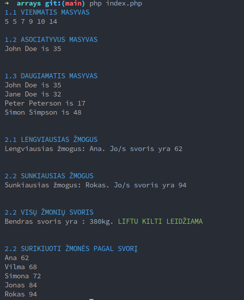
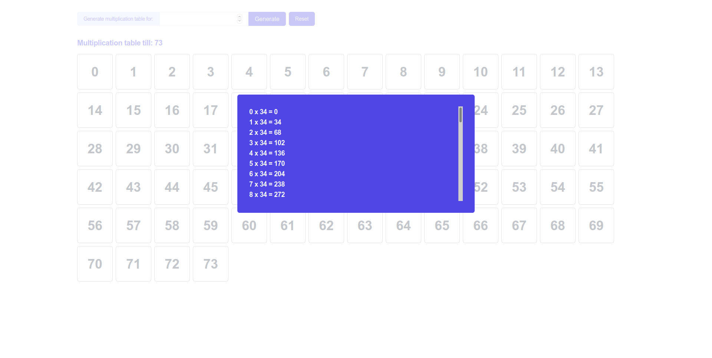
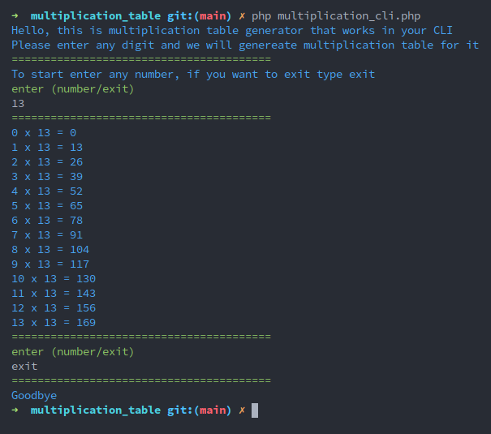
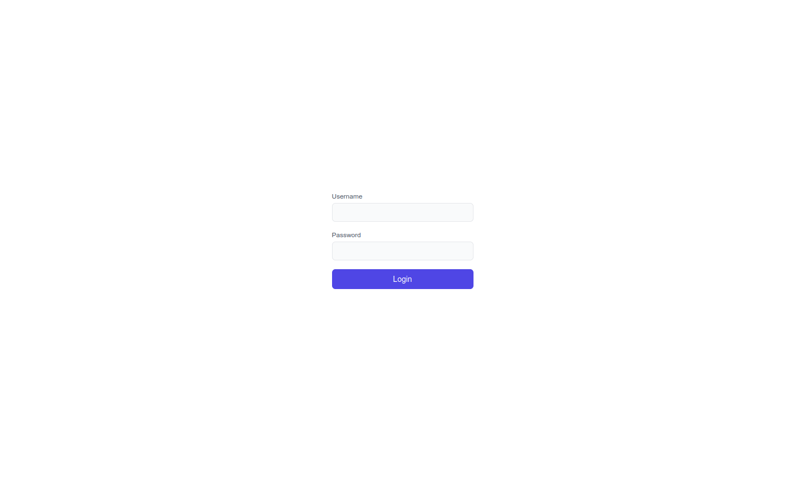
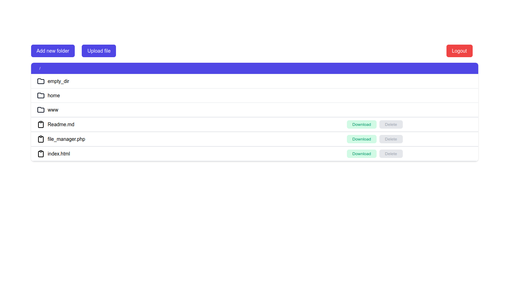
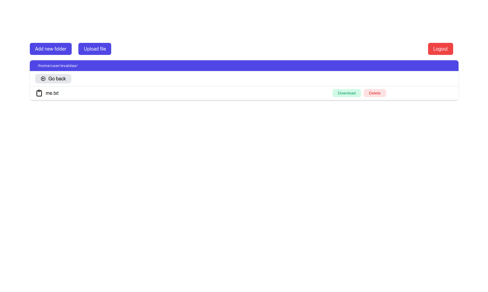
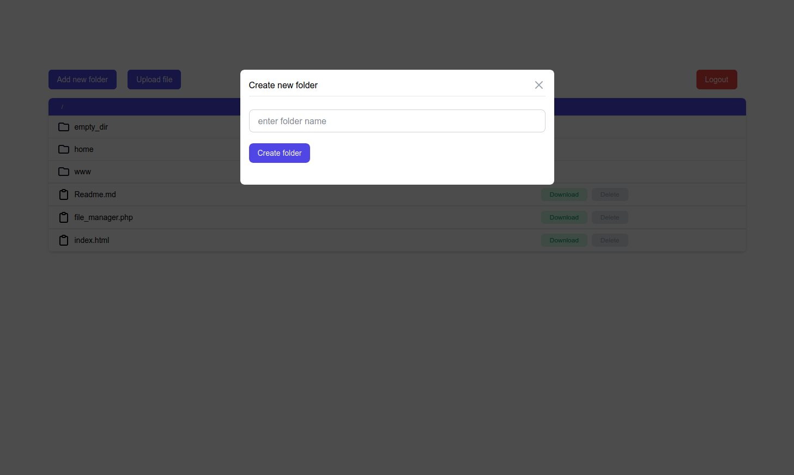
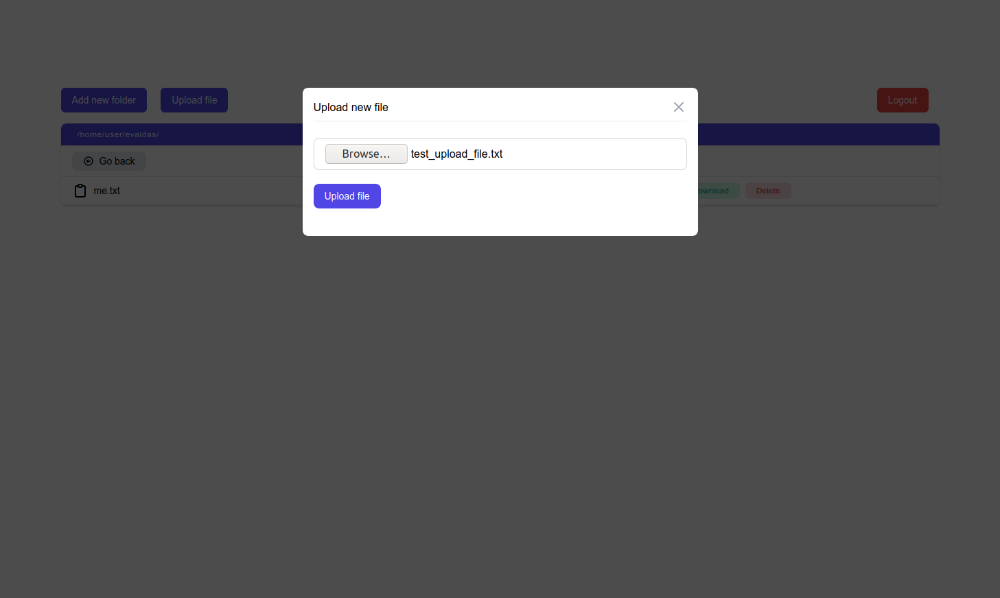
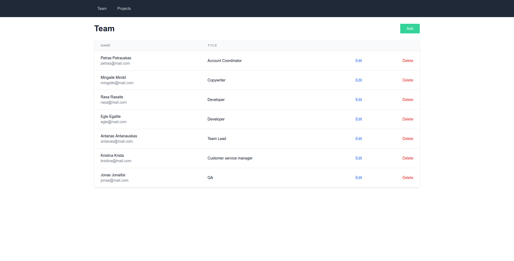
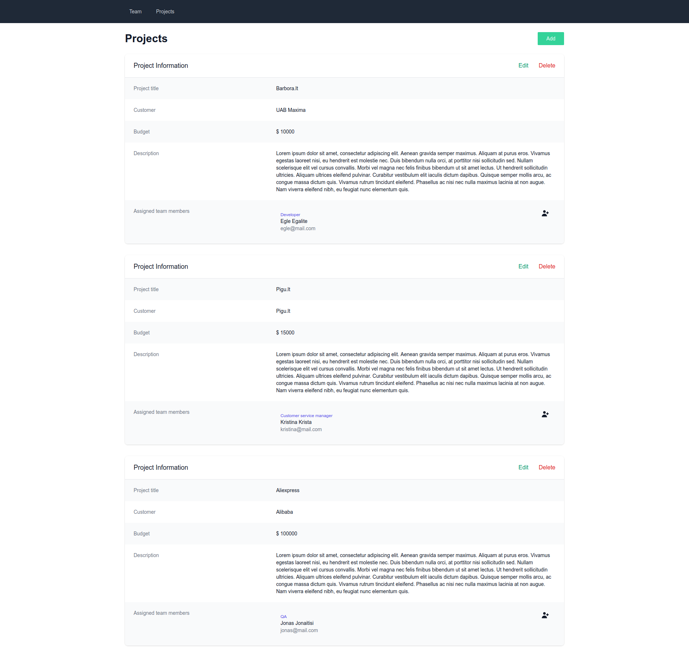

## Baltic Institute of Technology PHP Homework

---

### BMI Calculator

    

---

### Arrays

    

---

### Multiplication table

#### Web:

    

### CLI:

    

---

### File Explorer SPA

    
    
    
    
    

---

### Plain PHP CRUD

    
    

